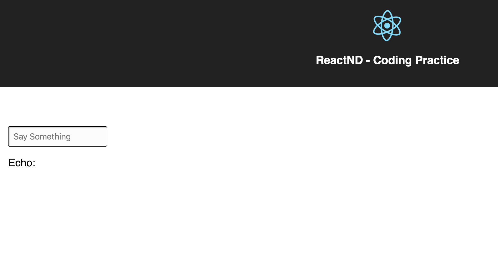
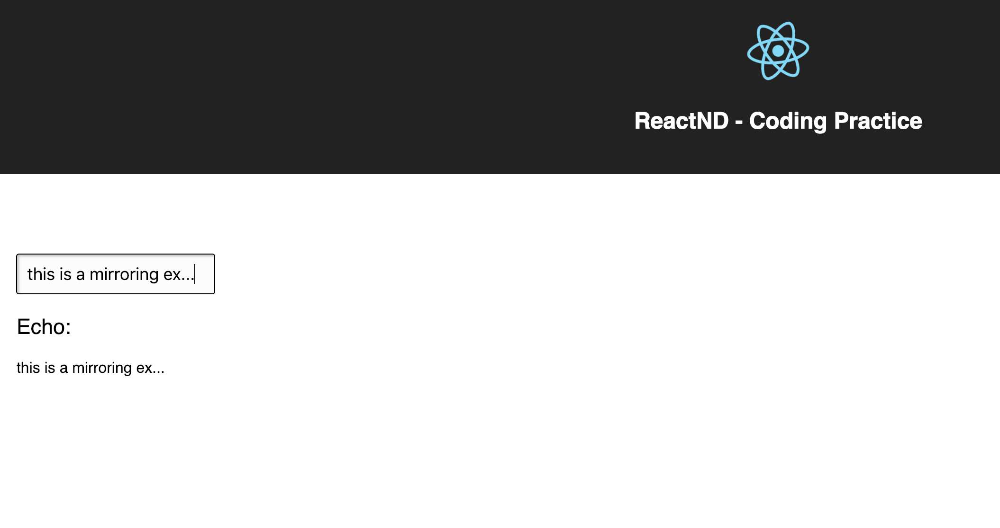

## How to run  the  application.

1. `npm install` - for getting local the required libs
2. `npm start` - for opening the project in browser

## About the application

This is a simple project with an input and a mirroring label.  
So the label will text mirror what we type into the input.
When all of the text is erased, nothing will be printed to the screen.

Initial screen:

After adding some text:

